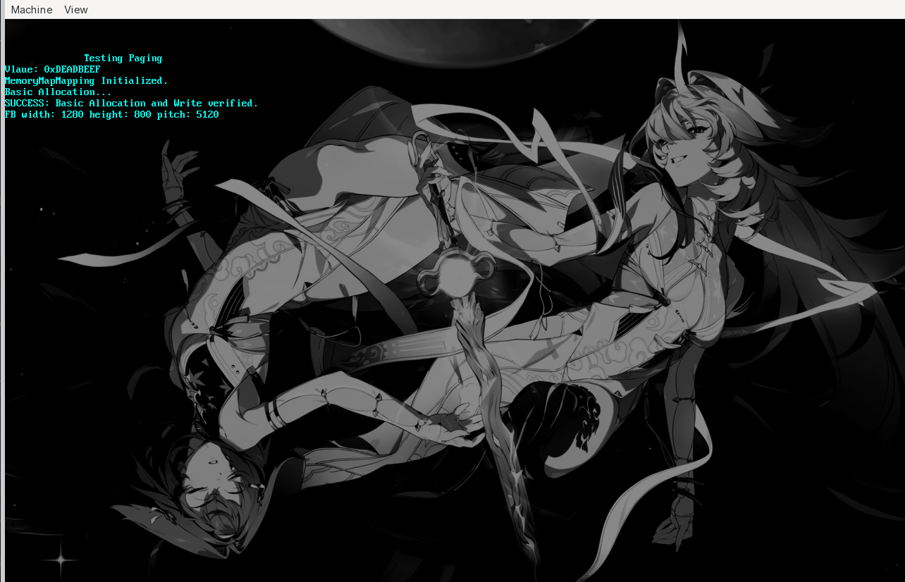

# PROJECT IS IN HIATUS

# sauceOS

## Overview

sauceOS is a lightweight, Unix-like operating system written in C and assembly by souls-syntax. This project is being actively developed as 
a personal journey to dive deeper into the world of operating systems. As such, sauceOS is constantly evolving, with new features and 
improvements being added over time. 

[]

### Core Systems
- ✅ Limine Boot Protocol
- ✅ Framebuffer Initialization
- ✅ Global Descriptor Table (GDT)
- ✅ Interrupt Handling (IDT / ISR / IRQ)
- ✅ Task State Segment (TSS)
- ✅ Memory Management
- 🚧 Processes & Multitasking
- 🚧 Shell

### Drivers
- ✅ Keyboard Driver
- ✅ Mouse Driver

### Planned Kernel Features
- ❌ File System
- ❌ ELF Loader
- ❌ Networking
- ❌ Audio
- ❌ Vim support

### Long-Term Experiments
- ❌ GUI
- ❌ OpenGL-like Renderer
- ❌ Doom Port

---

# $BUILDING

## Necessary Components

- Linux system (I have only tested it there)
- gcc
- nasm
- xorriso
- qemu-system-x86_64

## Compiling

chmod -x BUILD.sh

./BUILD.sh.
It will launch qemu automatically.

# CREDITS

Font originally from https://github.com/hubenchang0515/font8x16.

